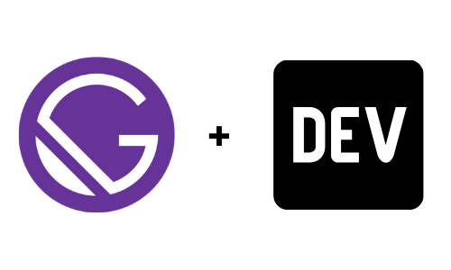

<p align="center">
  <a href="https://www.gatsbyjs.org">
    
  </a>
</p>
<h1 align="center">
  Gatsby Source Dev.to
</h1>

Do you use (or hope to use) Dev.to in creating posts? Well, things just got easier. This starter is a combination of [gatsby-starter-default](https://github.com/gatsbyjs/gatsby-starter-default) (Gatsby Default Starter) and [gatsby-source-devto](https://github.com/dillionmegida/gatsby-source-devto) (created by the starter author, for sourcing Dev.to posts).

Check out [gatsby-starter-default's repository README.md](https://github.com/gatsbyjs/gatsby-starter-default/#readme) for some brief introduction to Gatsby.

To use this starter,

## Create your site

1.  **Create a Gatsby site.**

    Use the Gatsby CLI to create a new site, specifying this starter.

    ```shell
    gatsby new my-blog https://github.com/dillionmegida/gatsby-starter-devto
    ```
      - **my-blog** is the new folder you want to use for the project

2.  **Start Proect.**

    Navigate into your new site’s directory and start it up.

    ```shell
    cd my-blog/
    gatsby develop
    ```

3.  **Open the source code and start editing!**

    Your site is now running at `http://localhost:8000`!

    In the graphql playground, `http://localhost:8000/___graphql`, you can query your DEV posts too.
    
    Learn more obout the plugin - [gatsby-source-devto](https://github.com/dillionmegida/gatsby-source-devto)

    Open the `my-blog` directory in your code editor and start configuring the website to suit your taste.

    **Note that:** one thing you'd need to do is to change the DEV username specified in `gatsby-config.js` to your own username.

## Author

[Dillion Megida](https://dillionmegida.com/about)

---

Happy Coding 😇